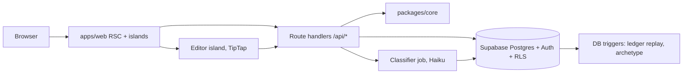

# Build plan
*19 September 2026. The repo copy of the Cowork "Dialecta Build Plan" doc. Backlog in `backlog.md`.*

## Decisions (ADR-001 to 003, 2026-09-19)

| Decision | Choice | Why |
| --- | --- | --- |
| Identity | Supabase Auth (magic link + Google). `profiles.user_id` is the key; `ghost_member_id` kept as a legacy mapping | Votes, ledgers, aspirations all need an identity the database owns |
| Articles and editor | Native from day one: `articles` in Supabase, TipTap editor storing JSON, server-rendered HTML. Five Ghost posts imported once; Ghost untouched until cutover, then cancelled | The Editorial Template's declaration questions and amendment window live inside the act of writing; no third-party editor can host that (ADR-001, ADR-003) |
| Classification | Async job (Edge Function or background function), never inline in the request | The sync Haiku call in `api/comment.js` blocks posting |
| Framework | Next.js 15 App Router, TypeScript, npm workspaces. Server components by default; five client islands | |

## Layout

```
apps/web/         Next.js, every page and route
packages/core/    tiers, pillars, archetypes, classifier prompt + parser, resolution, axis mapping (pure, tested)
supabase/         migrations, config, generated types
api/              legacy Vercel functions, frozen until apps/web replaces them
docs/             specs (canonical), handoffs/, reviews/, plans/
design/           design spec v1.3, logos; tokens.css is generated from it
components/       April to May prototypes, read-only reference
scripts/          voice_check.py, extract-tokens.mjs
.claude/          agents, skills, hooks, settings
council/          advisor charters, positions, research trees, debate log
tools/            local-research MCP server (Ollama on studio-pc)
```

## Architecture



Islands: comment composer, article editor, classification card, votes and nominations, fingerprint SVG, opinion maps. Everything else renders on the server. RLS replaces the service-role key on every browser path.

## Data model (foundation migration)

`profiles` (user_id uuid, ghost_member_id text legacy), `articles` (slug, key_claims, map_config, ghost_post_id), `comments` (author_id uuid, parent_id, status, final_tier, hardened_at), `classifications` (+ model, prompt_version), `comment_votes` (vote_type, target_tier, reason, note), `axis_events` (append-only), `axis_scores` (replayed), `archetypes`, `aspirations`, `recommitments`, `fp_snapshots`, `feed_events`, `opinion_positions`. All with RLS.

## Phases

| Phase | Weeks | Done when |
| --- | --- | --- |
| 0 Foundation | 1 | Tests green, preview deploys per PR, the five imported articles render at the preview URL, sign-in works |
| A Discourse and Publication | 3 to 4 | A real comment goes composer to classification to self-declaration to published thread with votes; an article is drafted, declared, and published in our editor |
| B Identity | 2 | Your own fingerprint renders from real comments |
| Cutover | 1 | dialecta.org served by apps/web; `api/` deleted; site-review structure changes live |
| C Newsletter and shutdown | 1 | Resend sends on publish; Ghost cancelled |
| D Mapping and Growth | 3+ | Per the Growth Layer prerequisites |

## The team

| Agent | Job | Model |
| --- | --- | --- |
| Lead (interactive) | Reads backlog and current.md, briefs, delegates, merges | Opus |
| builder | One item, one branch, tests first in core | Sonnet |
| spec-reader | Cites the spec; read-only | Haiku |
| reviewer | Correctness, RLS, spec drift, tokens, voice; findings only | Opus |
| voice-editor | Rewrites prose to v1.2, runs the checker | Sonnet |
| migrator | Migrations, RLS, types | Sonnet |
| decider | Chairs the council; frames options and a recommendation; writes ADRs | Opus |
| treasurer | Council advisor: profitability, unit cost, sustainability | Sonnet |
| designer | Council advisor: retention and experience inside the platform's ethics | Sonnet |
| philosopher | Council advisor: the thesis, contributor psychology, the design research | Opus |

Council: `/dialecta-council` runs positions in parallel, rebuttals, chair synthesis, Dan decides, ADR. Each advisor owns `council/<name>/` (charter, standing positions, research tree). `tools/local-research/` is an MCP server that runs embedding, search, and summarizing on the studio-pc GPU through Ollama, so bulk research costs local compute rather than API tokens; Claude Code's agents themselves still run on Claude models.

Hooks: `guard-docs` blocks spec and charter edits (override `SPEC_EDIT=1`); `voice-check` blocks hard-rule hits in prose and `strings.ts`; `handoff-note` stamps `docs/handoffs/current.md` on Stop. Skills: `dialecta-voice`, `dialecta-tokens`, `dialecta-migration`, `dialecta-brief`, `dialecta-decide`.

Rhythm: open with `backlog.md` and `current.md`; one item per session; PR with preview; reviewer pass; you merge; both files updated before the session ends. Spec changes happen in Cowork with Dan and land in `docs/` by hand.
