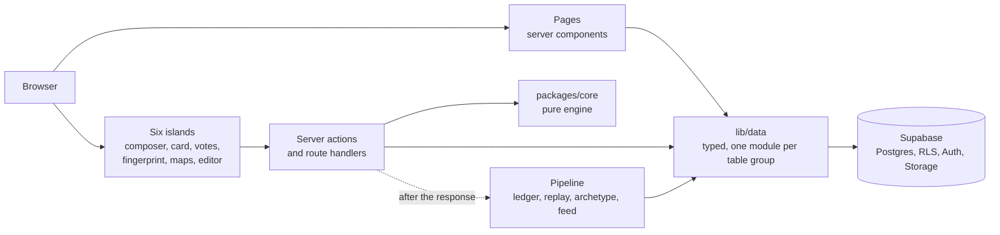

# Rebuild architecture

*The architect seat's recommendation for the Next.js rebuild, 2026-09-21, at Dan's request: "your
vision and mapping of how this will be built is essential." Also in Dan's doc "The Architect", tab
"Rebuild architecture". Recommended, not decided: the decisions are in the last section, each with its
owner.*

Build the spine before porting more surfaces: one identity key, one true migration history and one
typed data layer. Then port the council's files onto it in dependency order. Everything already
decided stands: `docs/plans/build-plan.md`, ADR-001 to 003, the backlog phases and
`council/log/2026-09-20-port-or-rewrite.md`.

## The shape

Pages render on the server; six islands handle interaction; every read and write goes through one
typed data layer; the engine stays pure.

Three rules make those arrows the only ones, and dependency-cruiser enforces all three in CI:

1. **Only `lib/data` touches Supabase.** No page, action or island imports `@supabase/*`. A schema
   change then lands in one module, and the generated types check every query in it.
2. **Only pipeline code holds the service key.** Everything a person triggers runs under their own
   session and row security.
3. **`packages/core` does no I/O.** It already holds this rule; the rebuild keeps domain knowledge
   there and nowhere else.

## The spine, first

Every ported surface reads a person, an article or a schema. Settle those three before porting more,
or each port bakes in the drift.

| Piece | Today, measured | Target | How |
| --- | --- | --- | --- |
| **Identity** | A person keyed three ways; 14 of 18 Ghost-keyed references have no foreign key; `profiles.user_id` is empty on all 14 profiles; articles keyed two ways | Every reference to a person is `profiles.id` (uuid) under a foreign key, every reference to an article is `articles.id`. Ghost ids live only on `profiles` and `articles`, as attributes | Add the uuid columns, backfill by join (rows are counted in dozens), move readers and writers, drop the text keys. A stable `current_profile_id()` turns `auth.uid()` into the profile once per statement. The existing claim flow links the 14 legacy profiles |
| **Migration history** | 7 of 14 September migrations match live; the 20 from April and May have no file; the hand-written baseline has 9 wrong markers | The repo's migrations reproduce live exactly | `supabase db pull` writes a true baseline from live, and `migration repair` aligns the history table. From then on every change goes to a branch first, then to production from the same file |
| **Typed data access** | `supabase/types.ts` is from 2026-09-19 and imported by nothing; 4 clients untyped; queries scattered across routes | One `server-only` module per table group in `lib/data`, owning its column lists and queries, typed by the regenerated `Database` | Regenerate types, type the four clients, move each query into its module. The ast-grep rule and dependency-cruiser make it stick |

One refinement to ADR-002, for decider. The ADR names `profiles.user_id` as the key, but 14 legacy
profiles have no auth user yet, and a profile should outlive an account. `profiles.id` carries the
ADR's intent, one identity the database owns, without either problem. `supabase/CLAUDE.md` already
says "everything Dialecta owns keys on `uuid`"; the live schema does not, and this is the step that
makes it true.

Staging depends on the second row. A Supabase preview branch "applies pending database migrations"
and starts with no production data, so it cannot reproduce production until the history does.

## Write paths

Classification stays synchronous, because the spec says the writer waits and sees the card before
posting (Discourse Layer UX, Stage 1; `Dialecta_Supabase_Scaling.md` marks `comments` and
`classifications` as sync; `exchange/open/2026-09-19-002-advice-a1-composer-request-path.md`). What
changes is that each state change becomes one transaction, and the downstream work leaves the request.

| Step | Runs in | Why |
| --- | --- | --- |
| Classify the draft | The route handler, before any write | The spec's flow. A model failure costs the writer a retry, never a stored half-row |
| Store the comment and its classification | One database function, one transaction | Today they are two statements (`apps/web/src/app/api/comment/route.ts:210` and `:245`); a failure between them leaves a comment with no classification |
| Self-declare, Stage 2.5, publish | A server action calling one database function; `resolveFinalTier` from core | The rule is core's; the state change is atomic |
| Axis events, score replay, archetype, feed | `after()` in the publish action, for that one member; a nightly job replays everyone | The scaling spec marks these async. Replay is idempotent, so the nightly run is also the repair path |
| Publish or amend an article | A server action calling one function: `body_json`, `body_html`, declared claims, status, `published_at`, `amend_until`; then revalidate the article's path | ADR-003's contract, as one step |

`after()` is stable in the Next.js 15.5 this app pins, runs in route handlers and server actions, and
uses Vercel's `waitUntil`. Move to a queue when a measured number says so: when one member's replay no
longer fits the route's `maxDuration`, or the nightly replay passes a limit the team sets.

## The app

| Concern | Rule |
| --- | --- |
| Routes | A `(read)` group for public pages (front page, article, profile, community, Pact, Guidebook) as server components. A `(member)` group for `/write`, settings and notifications, behind one layout that resolves the session once. `/analytics` stays gated as it is. Admin stays in Supabase Studio: the council dropped `dialecta-dev-admin.jsx` as a port target |
| Islands | Exactly the build plan's six: composer, classification card, votes and nominations, fingerprint, opinion maps, editor. Each gets its data from a server component and changes data through a server action. No island imports a Supabase client |
| The shell | `shell.jsx` becomes a provider in the root layout, per the council's ruling |
| Authorization | Middleware only refreshes the session. Every decision runs in server code on `getClaims()`, never trusting the request body. On 15.5 the file is `middleware.ts`; `proxy.ts` is a 16 name and is never invoked here |
| Caching | Next 15 caches nothing by default. Public pages set a `revalidate` window, and publish or amend calls `revalidatePath` for the article and the front page |
| Ported files | Islands land in `components/<surface>/`, pages under the route groups, and their queries in `lib/data`. Every file the council marked "Adapted (auth rewritten)" takes identity from the session and writes through a server action. None reads identity from the DOM or the body |

## Security by construction

Row security answers who sees a row; it says nothing about which columns.

| Layer | Rule | Why now |
| --- | --- | --- |
| Rows | Row security on every table, with policies through `(select current_profile_id())` | The identity spine makes this one expression instead of a Ghost-id lookup per table |
| Columns | A public read goes through a view that names its columns; `anon` loses table-level `select` on any table with a private column | Every column on `profiles` is readable without sign-in today, and `comments.member_id` still carries the Phase 0 credential (`exchange/open/2026-09-21-convener-05`). `security` holds that ruling; the views are where it lands |
| Functions | One global `alter default privileges revoke execute on functions from public`, and every function revokes from `public` and `anon` by name | A revoke on 2026-09-21 removed `anon` and left `public`. `checks/anon-execute.sql` is the gate |
| The service key | Imported only by pipeline modules in `lib/data` | A dependency-cruiser rule, so a page or island cannot reach it |
| Deny markers | The 19 permissive `USING (false)` policies become restrictive, or are named as markers | They grant nothing today, and a later permissive policy would silently override them. `security`'s call |

## Fitness functions

Each rule above has a check that fails the build when the rule breaks. This seat defines them and
`builder` wires them, in this order:

| Gate | Holds true | Switch on |
| --- | --- | --- |
| Typecheck, vitest, voice | What CI checks today | Already on |
| Lint | `eslint` passes, as it does today | Now |
| dependency-cruiser, per workspace | The three boundary rules, no cycles, no unresolvable import | Now; it passes today |
| Enum test in `packages/core` | Core's value lists equal the generated `Constants` | With the identity step |
| ast-grep typed-client rule | Every Supabase client carries `Database` | After the typed-data step |
| `apps/web` tests | Each write path, starting with the comment route | With the first ported write path |
| squawk | Migrations will not lock a table they should not | On any changed migration file |
| Migration history and type freshness | The repo matches live, and `types.ts` matches live | Once a read-only database credential exists for CI |
| knip and `jscpd --baseline` | No new dead code or copied blocks | Once a baseline is committed |

## Build order

| # | Step | Owner | After | Unblocks |
| --- | --- | --- | --- | --- |
| 1 | Pull a true baseline from live, repair the migration history, stand up staging on it | migrator, with Dan's approval | nothing | Branch-first migrations; the end of drift |
| 2 | Re-key identity to `profiles.id` and `articles.id` on a branch, then production | migrator; decider rules on the key column | 1 | Every policy and every port that reads a person |
| 3 | Regenerate types, type the four clients, build the `lib/data` modules, switch on the first gates | builder | 2 | Compile-time checks on every query |
| 4 | Public read views and policies: comments, profiles, community | migrator, security | 2 | The discourse thread (A-5), profiles (B-3), community (B-5) |
| 5 | Comment write as one function; port the composer and classification card | builder | 3, 4 | The first real discourse (A-1 to A-4) |
| 6 | Editor and article server with the atomic publish function | builder | 3 | Native publishing (A-10, A-11) |
| 7 | Axis ledger through `after()` plus the nightly replay; archetype after the "forming" ruling; fingerprint port | builder | 5 | Identity from real comments (B-1, B-2, B-4) |
| 8 | Cutover as the backlog sets it out | convener | 5, 6, 7 | dialecta.org on `apps/web` (C0) |

Once step 2 lands, step 4 runs beside step 3. Step 6 starts when step 3 lands; step 5 also waits for
step 4. Nothing parallelises safely before step 2.

## Decisions this needs

Six. One is Dan's alone, three reach him through decider or migrator, and two are settled below him
unless he overrides them.

| Decision | Recommendation | Who decides |
| --- | --- | --- |
| The identity key column | `profiles.id`, recorded as a note on ADR-002 | decider, then Dan |
| Migration history | Pull a true baseline from live and repair the history before any other migration | migrator; Dan approves, since it writes to the history table |
| Staging | Supabase branching once the history reproduces live, or a staging project built from the pulled baseline | Dan, since it is a plan and cost choice |
| "forming" | An archetype value, as the spec says, or a confidence level, as live stores it (`exchange/open/2026-09-21-architect-03`) | decider, then Dan |
| The downstream runner | `after()` plus a nightly replay now; a queue when a named measurement says so | decider |
| The data-access boundary | Only `lib/data` touches Supabase; only pipeline code holds the service key | This seat, as a standard; open to Dan's override |

## Sources

- Supabase MCP server: https://supabase.com/docs/guides/getting-started/mcp
- `supabase db pull`: https://supabase.com/docs/reference/cli/supabase-db-pull
- Supabase branching: https://supabase.com/docs/guides/deployment/branching
- Next.js 15 `after()`: https://nextjs.org/docs/15/app/api-reference/functions/after
- The house: `docs/plans/build-plan.md`, `docs/decisions/`, `docs/plans/backlog.md`,
  `council/log/2026-09-20-port-or-rewrite.md`, and this seat's measurements in `../knowledge/`
